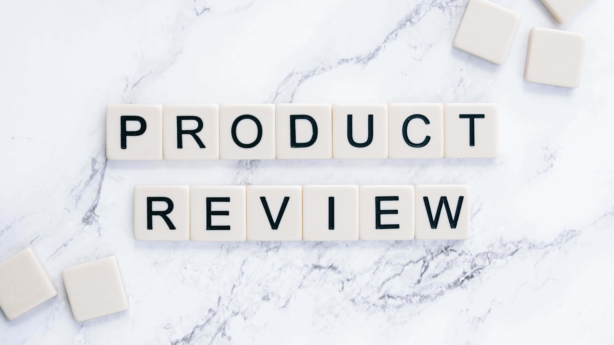
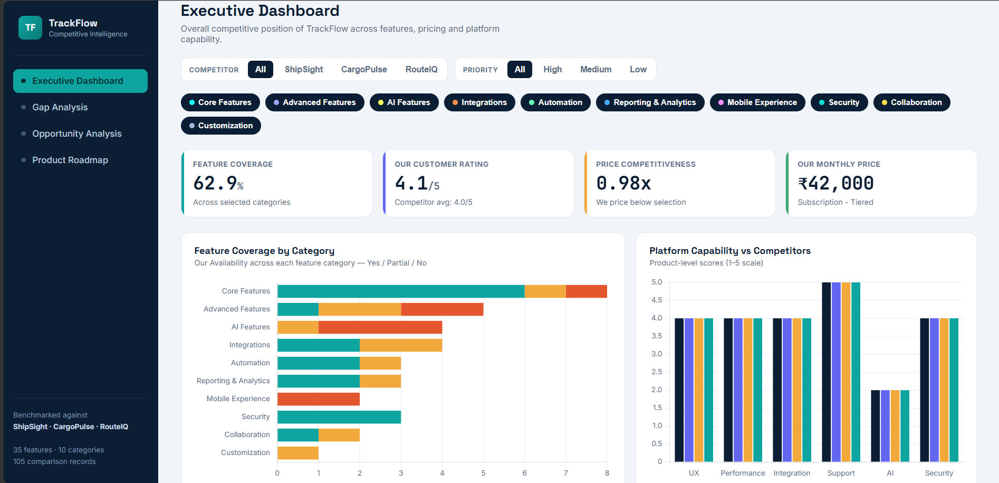
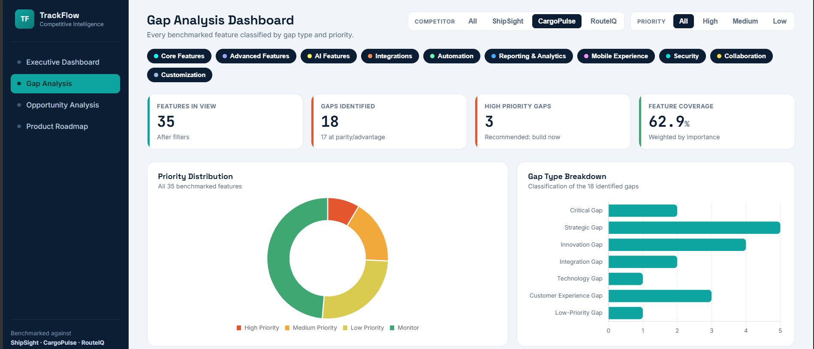
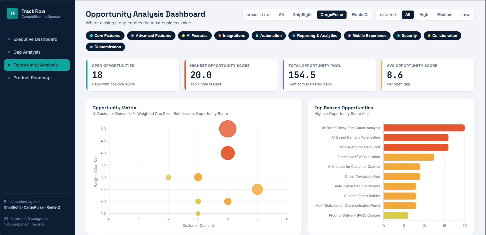
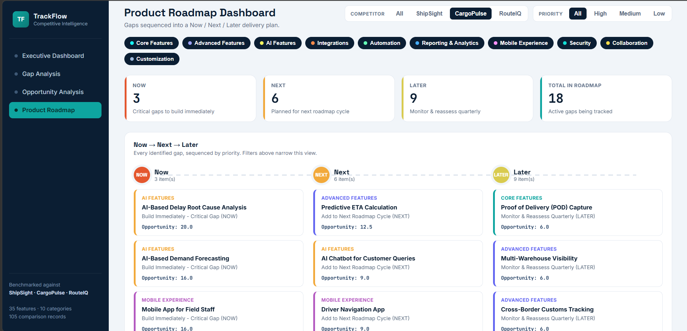

# Competitive Product Benchmarking & Gap Analysis Tool

## 📊 Overview

A non-coding Excel + Power BI portfolio project designed to benchmark a productivity SaaS product against competitors, identify competitive gaps and prioritize product improvement opportunities.

## 🎯 Objective

The objective is to create a structured competitive benchmarking framework that helps product teams:

- Compare product features
- Compare pricing
- Analyze customer experience
- Identify competitive gaps
- Quantify opportunities
- Prioritize product improvements
- Support product roadmap decisions

## 🏢 Benchmark Product

FlowSync

## 🥇 Competitors

- Asana
- Monday.com
- ClickUp
- Notion

## 📁 Dataset

The portfolio dataset contains:

- 34 product features
- 10 feature categories
- 170 structured benchmark records

### Feature Categories

1. Core Project Management
2. Collaboration
3. Analytics & Reporting
4. Automation
5. AI
6. Integrations
7. Security
8. Mobile
9. Customization
10. Customer Support

## 🧹 Data Cleaning

Data preparation included:

- Standardizing product names
- Standardizing feature categories
- Standardizing availability values
- Checking duplicates
- Checking missing values
- Converting numerical fields
- Preparing Power BI-ready tables

## 📐 Scoring Methodology

### Availability Score

Yes = 100%

Partial = 50%

No = 0%

### Feature Score

Feature Score = Availability Score × Feature Importance

### Feature Gap

Feature Gap = MAX(0, Competitor Score - FlowSync Score)

### Competitive Advantage

Competitive Advantage = MAX(0, FlowSync Score - Competitor Score)

### Opportunity Score

Opportunity Score = Feature Gap × Customer Demand × Feature Importance

### Priority

High = ≥ 40

Medium = ≥ 20

Low = < 20

## 📊 Dashboard

The Power BI dashboard is structured into:

### 1. Executive Dashboard

- Overall Benchmark Score
- Feature Coverage
- Market Share
- Customer Rating
- Competitor Comparison
- Pricing Comparison

### 2. Gap Analysis Dashboard

- Competitive Feature Gaps
- Gap Type
- Priority
- AI Gaps
- Integration Gaps

### 3. Opportunity Analysis

- Opportunity Score
- Business Value
- Customer Demand
- Development Effort
- Priority

### 4. Product Roadmap

NOW / NEXT / LATER recommendations.

## 🔍 Key Findings

- FlowSync has a strong core product foundation.
- AI capabilities represent a major improvement opportunity.
- Enterprise integrations provide actionable opportunities.
- Feature prioritization is more useful than simply counting missing features.
- Customer demand and business importance should influence roadmap decisions.

## 🛠️ Tools

- Microsoft Excel
- Power Query
- Power BI
- GitHub
- PowerPoint

## 📂 Repository Structure

competitive-product-benchmarking/

├── README.md

├── data/

├── excel/

├── powerbi/

│   └── dashboard_screenshots/

├── ppt/

└── docs/

## ⚠️ Data Note

The competitor values used in this portfolio model are illustrative benchmark assumptions for demonstration purposes.

For professional or business use, competitor information should be replaced with verified and current public data and appropriate sources.

## 👩🏻‍💻 Skills Demonstrated

- Business Analytics
- Competitive Analysis
- Product Analytics
- Data Cleaning
- KPI Analysis
- Excel
- Power Query
- Power BI
- Dashboard Development
- Data-Driven Decision Making
- Product Prioritization
